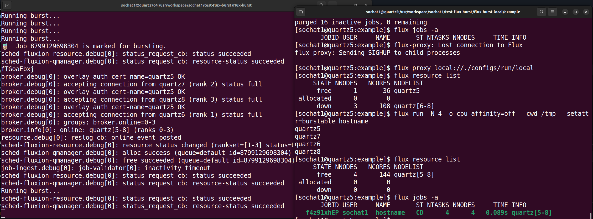
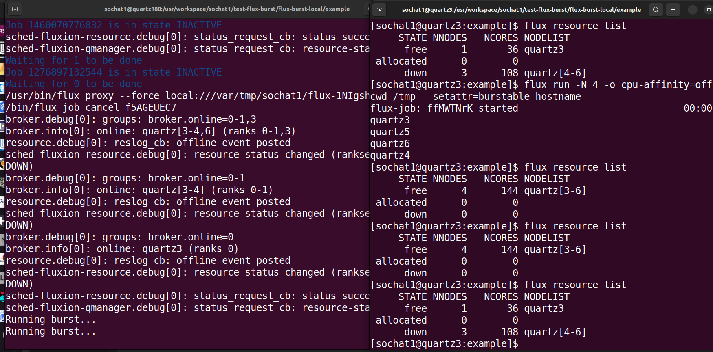

# Flux Burst Local Examples

This will include examples for local bursting.

## Allocation burst

For this first use case, we assume that we have some allocation we are sitting on
with N resources, and we want to start a lead broker at index 0 and then allow bursting
to 1-N. This example varies slightly in comparison to the others because
it will both create the lead broker _and_ then run flux-burst using the plugin
to do the burst, while the others assume starting already instead the running
lead broker. We are choosing this design because likely a local burst will need
to do (and automate) both steps. The general usage is the following:

### 0. Install Flux Burst

Next we need to install stuff! I did this _outside_ the allocation in case it matters. Likely you will have variance in your Python environment.
I wound up:

1. Using the system Flux + Python
2. Using my local environment pip to install to the python user site
3. Installing flux bindings that matched my version of flux.

I was able to install flux bindings to my local python environment (associated with python 3.6 on the system):

**IMPORTANT** Ensure that for all commands you run, you use the same Flux. The scripts will find the first on your path. If the versions are different we use `--force` for the flux proxy that starts the down brokers, however to avoid unpredictable errors it's better to be consistent and use the same install of flux.
Make a working directory:

```bash
mkdir test-flux-burst
cd test-flux-burst
```

And installed flux-burst and flux-burst local (you can also clone repositories)

```bash
pip3 install flux-burst
pip3 install flux-burst-local
pip3 install flux-python==0.48.0rc6 --user
```

You might need to add `--user` if you get a permissions error. Mine installed to my user site by default.

### 1. Create an allocation.

First, create a Flux instance to work from. This is how you do that from SLURM. This would be for four nodes.

```bash
srun -N 4 --time 60:00 -ppdebug --pty flux start
```
**Don't forget to check the path of flux you are using**. When you get the allocation, you can verify your resources as follows:

```bash
$ flux resource list
     STATE NNODES   NCORES NODELIST
      free      4      144 quartz[8-11]
 allocated      0        0
      down      0        0
```

Then generate the configs for the hosts we got. Note that since this is no longer slurm, we won't get them from the environment variable.
I was lazy and grabbed them from `flux resource list` (there likely is a better way!)

```bash
export PYTHONPATH=$HOME/.local/lib/python3.8/site-packages:$PYTHONPATH
export PATH=$HOME/.local/bin:$PATH
cd /usr/workspace/sochat1/test-flux-burst/flux-burst-local/example
python3 burst-allocation.py --config-dir ./configs --network-device "*" --hostnames quartz[5-8] --flux-uri $FLUX_URI
```
```console
$ python3 burst-allocation.py --config-dir ./configs --network-device "*" --hostnames quartz[5-8] --flux-uri $FLUX_URI
🌳️ Flux root set to /usr
🌀️ Done! Use the following command to start your Flux instance and burst!
    It is also written to /usr/WS2/sochat1/test-flux-burst/flux-burst-local/example/configs/start.sh

/usr/bin/flux start --broker-opts --config /usr/WS2/sochat1/test-flux-burst/flux-burst-local/example/configs/system -Stbon.fanout=256 -Srundir=/usr/WS2/sochat1/test-flux-burst/flux-burst-local/example/configs/run -Sstatedir=/usr/WS2/sochat1/test-flux-burst/flux-burst-local/example/configs/run -Slocal-uri=local:///usr/WS2/sochat1/test-flux-burst/flux-burst-local/example/configs/run/local -S pty.interactive -Slog-stderr-level=7 -Slog-stderr-mode=local -Sbroker.quorum=0 /g/g0/sochat1/.local/bin/flux-burst-local --config-dir /usr/WS2/sochat1/test-flux-burst/flux-burst-local/example/configs/system --flux-root /usr --flux-uri local:///var/tmp/sochat1/flux-TvAVr6/local-0
```

That will generate the entire "configs" directory that you can check before running the command. When you are ready - copy paste the above and run it!

<details>

<summary>Expected output of command</summary>

```console
broker.debug[0]: insmod connector-local
broker.info[0]: start: none->join 14.5897ms
broker.info[0]: parent-none: join->init 0.025185ms
connector-local.debug[0]: allow-guest-user=true
connector-local.debug[0]: allow-root-owner=true
broker.debug[0]: insmod barrier
broker.debug[0]: insmod content-sqlite
content-sqlite.debug[0]: /usr/WS2/sochat1/test-flux-burst/flux-burst-local/example/configs/run/content.sqlite (22 objects) journal_mode=WAL synchronous=NORMAL
broker.debug[0]: content backing store: enabled content-sqlite
broker.debug[0]: insmod kvs
kvs.info[0]: restored KVS from checkpoint on 2023-07-15T02:17:45Z
broker.debug[0]: insmod kvs-watch
broker.debug[0]: insmod resource
resource.debug[0]: reslog_cb: resource-init event posted
resource.debug[0]: reslog_cb: resource-define event posted
broker.debug[0]: insmod cron
cron.info[0]: synchronizing cron tasks to event heartbeat.pulse
broker.debug[0]: insmod job-manager
job-manager.debug[0]: jobtap plugin .history registered method job-manager.history.get
job-manager.info[0]: restart: 0 jobs
job-manager.info[0]: restart: 0 running jobs
job-manager.debug[0]: restart: max_jobid=0
job-manager.debug[0]: duration-validator: updated expiration to 0.00
broker.debug[0]: insmod job-info
broker.debug[0]: insmod job-list
job-list.debug[0]: job_state_init_from_kvs: read 0 jobs
broker.debug[0]: insmod job-ingest
job-ingest.debug[0]: configuring validator with plugins=(null), args=(null) (enabled)
job-ingest.debug[0]: fluid ts=1ms
broker.debug[0]: insmod job-exec
job-exec.debug[0]: using default shell path /usr/libexec/flux/flux-shell
job-exec.debug[0]: using imp path /usr/libexec/flux/flux-imp
broker.debug[0]: insmod heartbeat
broker.info[0]: rc1.0: running /etc/flux/rc1.d/01-flux-account-priority-update
broker.info[0]: rc1.0: running /etc/flux/rc1.d/01-sched-fluxion
broker.debug[0]: insmod sched-fluxion-resource
sched-fluxion-resource.info[0]: version 0.26.0
sched-fluxion-resource.debug[0]: mod_main: resource module starting
sched-fluxion-resource.warning[0]: create_reader: allowlist unsupported
sched-fluxion-resource.debug[0]: resource graph datastore loaded with rv1exec reader
sched-fluxion-resource.info[0]: populate_resource_db: loaded resources from core's resource.acquire
sched-fluxion-resource.debug[0]: resource status changed (rankset=[all] status=DOWN)
sched-fluxion-resource.debug[0]: mod_main: resource graph database loaded
broker.debug[0]: insmod sched-fluxion-qmanager
sched-fluxion-qmanager.info[0]: version 0.26.0
sched-fluxion-qmanager.debug[0]: service_register
sched-fluxion-qmanager.debug[0]: enforced policy (queue=default): fcfs
sched-fluxion-qmanager.debug[0]: effective queue params (queue=default): default
sched-fluxion-qmanager.debug[0]: effective policy params (queue=default): default
sched-fluxion-qmanager.debug[0]: handshaking with sched-fluxion-resource completed
job-manager.debug[0]: scheduler: hello
job-manager.debug[0]: scheduler: ready unlimited
sched-fluxion-qmanager.debug[0]: handshaking with job-manager completed
broker.info[0]: rc1.0: running /etc/flux/rc1.d/02-cron
broker.info[0]: rc1.0: /etc/flux/rc1 Exited (rc=0) 2.1s
broker.info[0]: rc1-success: init->quorum 2.09608s
broker.debug[0]: groups: broker.online=0
broker.info[0]: online: quartz5 (ranks 0)
broker.info[0]: quorum-full: quorum->run 0.101144s
resource.debug[0]: reslog_cb: online event posted
sched-fluxion-resource.debug[0]: resource status changed (rankset=[0] status=UP)
flux-burst client is loaded with plugins for: local
Running burst...
```

</details>

The above is going to sleep every 5 seconds and try to run a burst. Bursting happens based on jobs needing it, and specifically
it will look at nodes free + nodes down, and compare to nodes needed, and bring up those that are possible and needed (so a burst
will just happen once / until all node are up). Let's do that next!
In another terminal, connect to your same lead broker node and then the local socket (e.g quartz5)

```bash
# Connect to your allocation node
ssh quartz<N>
cd /usr/workspace/sochat1/test-flux-burst/flux-burst-local/example
flux proxy local://./configs/run/local
```

You should see all the instances, that the main broker is online and the other nodes offline:

```bash
$ flux resource list
     STATE NNODES   NCORES NODELIST
      free      1       36 quartz5
 allocated      0        0
      down      3      108 quartz[6-8]
```

Now we want to test running a flux job and targeting the three down workers. Submit a burstable job that needs two nodes.

```bash
flux run -N 4 -o cpu-affinity=off --cwd /tmp --setattr=burstable hostname
```

You should see in the other terminal (running the lead broker) the burst accepted and the nodes come online!

```console
Running burst...
Running burst...
🧋️  Job 8799129698304 is marked for bursting.
sched-fluxion-resource.debug[0]: status_request_cb: status succeeded
sched-fluxion-qmanager.debug[0]: status_request_cb: resource-status succeeded
fTGoaEbxj
broker.debug[0]: overlay auth cert-name=quartz5 OK
broker.debug[0]: accepting connection from quartz7 (rank 2) status full
broker.debug[0]: overlay auth cert-name=quartz5 OK
broker.debug[0]: accepting connection from quartz8 (rank 3) status full
broker.debug[0]: overlay auth cert-name=quartz5 OK
broker.debug[0]: accepting connection from quartz6 (rank 1) status full
broker.debug[0]: groups: broker.online=0-3
broker.info[0]: online: quartz[5-8] (ranks 0-3)
resource.debug[0]: reslog_cb: online event posted
sched-fluxion-resource.debug[0]: resource status changed (rankset=[1-3] status=UP)
sched-fluxion-qmanager.debug[0]: alloc success (queue=default id=8799129698304)
sched-fluxion-qmanager.debug[0]: free succeeded (queue=default id=8799129698304)
job-ingest.debug[0]: job-validator[0]: inactivity timeout
...
```

In your terminal where you ran the job, you'll see hostnames!

```bash
$ flux run -N 4 -o cpu-affinity=off --cwd /tmp --setattr=burstable hostname
quartz5
quartz7
quartz6
quartz8
```

And if you look at resources, they will all have come online. The reason is because we have the burst plugin
submit a flux proxy command that does flux start on the same config directory on the number of worker nodes needed,
bringing them online.

```bash
[sochat1@quartz5:example]$ flux resource list
     STATE NNODES   NCORES NODELIST
      free      4      144 quartz[5-8]
 allocated      0        0
      down      0        0
```

And finally, the job will have run.

```
[sochat1@quartz5:example]$ flux jobs -a
       JOBID USER     NAME       ST NTASKS NNODES     TIME INFO
   f4z91xhEP sochat1  hostname   CD      4      4   0.089s quartz[5-8]
```

Here is a screenshot of the first ever burst I got working!



And here is what it looks like when the bursted jobs are cleaned up:



Note that we currently don't add a `--requires` parameter to limit the proxy to not hit the lead broker and we should
do that. I had trouble with it because of the space in the parameter. For reference, that command
looks like this.

```bash
flux proxy $FLUX_URI flux submit -N 3 --requires "not rank:0" /usr/bin/flux start --broker-opts --config /usr/WS2/sochat1/test-flux-burst/flux-burst-local/example/configs/system
```

And that's it! See [development](development.md) for a whole ton of things I tested before this.
